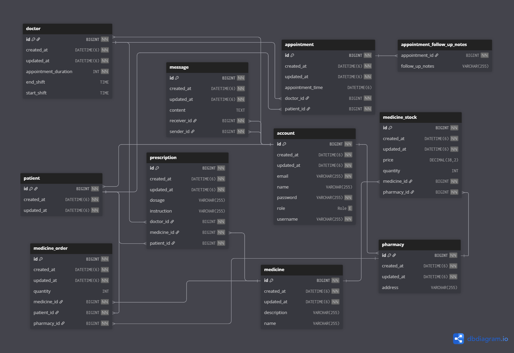

# Hospital System

A secure, modular, and testable RESTful API built with Spring Boot, designed to manage patient-doctor interactions, appointments, medicine purchases, and administrative tasks within a hospital environment. It supports core functionalities such as user authentication (admin, doctor, patient, pharmacy), appointment booking, patient follow-up, chat functionality, medicine management (CRUD operations), and role-based access control using JWT.

## Tech Stack

- Java 17
- Spring Boot (Web, Data JPA, Security, Validation, Lombok)
- MySQL (production database)
- H2 (in-memory database for development and testing)
- JWT (JSON Web Tokens) for authentication/authorization

---

## Quick Start

### Prerequisites

- Java 17 installed and on PATH
- Maven 3.9+ or Gradle 8+ (choose one)

### Clone and run

Using Maven:
```bash
mvn clean spring-boot:run
```
Using Gradle:
```bash
gradle bootRun
```
Build an executable JAR:
```bash
mvn clean package
java -jar target/graduation-project*.jar
```
The API will start at:
```
http://localhost:8080
```

Build project with Docker:
```bash
docker-compose up --build
```
The API will start at:
```
http://localhost:8999
```

### Entity Diagram


---

## Configuration

Edit `src/main/resources/application.properties` to customize:
```properties
# App
spring.application.name=graduation-project

secret.key=68a2c29cd8a364cae0dd08c967840986ff49053c9ec4bdb6382ca1cf8f8f793e25f07e8fef89cddad8e76e97876d674b4d8eb8d3d91c8892b1d58936c0d445f0

spring.datasource.url=jdbc:mysql://localhost:3306/hospital_db
spring.datasource.username=root
spring.datasource.password=root

spring.jpa.hibernate.ddl-auto=update
```

---

## Authentication and Authorization

- Authentication: JWT-based
- Roles: `ADMIN`, `DOCTOR`, `PATIENT`, `PHARMACY`
- How it works:
    1. Register a user.
    2. Login to receive a JWT token.
    3. Send the JWT token with requests using the Authorization header: `Authorization: Bearer <TOKEN>`.

### Endpoints (Auth and User)

Base path for auth: `/auth`

- POST `/auth/<type>/register` — register a new <type> user (admin, doctor, patient, pharmacy)
- POST `/auth/login` — login and receive JWT token

Login request example:
```http
POST /auth/login HTTP/1.1
Host: localhost:8080
Content-Type: application/json

{
  "username": "<USERNAME>",
  "password": "<PASSWORD>"
}
```
Login response example:
```json
{
  "message": "Login",
  "data": "<JWT_TOKEN>"
}
```
Use the token on subsequent requests:
```http
Authorization: Bearer <JWT_TOKEN_STRING>
```

---

### Patient Controller - `/api/patients`

| Method | Endpoint                                             | Request Body                  | Action                                 | Role                     |
|--------|------------------------------------------------------|-------------------------------|----------------------------------------|--------------------------|
| GET    | `/api/patients`                                      | None                          | Get all patients                       | ADMIN                    |
| GET    | `/api/patients/{id}`                                 | None                          | Get a patient by ID                    | ADMIN, SELF              |
| PUT    | `/api/patients/{id}`                                 | AccountRegistrationRequestDTO | Update a patient by ID                 | SELF                     |
| DELETE | `/api/patients/{id}`                                 | None                          | Delete a patient by ID                 | ADMIN, SELF              |
| GET    | `/api/patients/{doctorId}`                           | None                          | Get all patients of a doctor           | ANY                      |
| GET    | `/api/patients/patients/{patientId}/medical-history` | None                          | Get a patient’s medical history        | ANY                      |
| GET    | `/api/patients/patients/{patientId}/consultations`   | None                          | Get a patient’s previous consultations | ANY                      |

---

### Doctor Controller - `/api/doctor`

| Method | Endpoint                                             | Request Body                  | Action                                     | Role   |
|--------|------------------------------------------------------|-------------------------------|--------------------------------------------|--------|
| GET    | `/api/doctor/all`                                    | None                          | Get all registered doctors                 | ADMIN  |
| PUT    | `/api/doctor/update/{doctorId}`                      | AccountRegistrationRequestDTO | Update a doctor by ID                      | DOCTOR |
| DELETE | `/api/doctor/delete/{doctorId}`                      | None                          | Delete a doctor by ID                      | ADMIN  |
| GET    | `/api/doctor/available?date={date}`                  | None                          | Get available doctors for a date           | ANY    |
| GET    | `/api/doctor/available-slots/{doctorId}?date={date}` | None                          | Get available slots for a doctor on a date | ANY    |

---

### Message Controller - `/api/chat`

| Method | Endpoint                        | Request Body         | Action                                     | Role    |
|--------|---------------------------------|----------------------|--------------------------------------------|---------|
| GET    | `/api/chat/doctor/{doctorId}`   | None                 | Get chat messages between patient & doctor | PATIENT |
| POST   | `/api/chat/doctor/{doctorId}`   | MessageRequestDTO    | Send a message from patient to doctor      | PATIENT |
| GET    | `/api/chat/patient/{patientId}` | None                 | Get chat messages between doctor & patient | DOCTOR  |
| POST   | `/api/chat/patient/{patientId}` | MessageRequestDTO    | Send a message from doctor to patient      | DOCTOR  |

---

### Pharmacy Controller - `/api/pharmacy`

| Method | Endpoint                            | Request Body                  | Action                        | Role    |
|--------|-------------------------------------|-------------------------------|-------------------------------|---------|
| GET    | `/api/pharmacy/all`                 | None                          | Get all registered pharmacies | ADMIN   |
| PUT    | `/api/pharmacy/update/{pharmacyId}` | AccountRegistrationRequestDTO | Update a pharmacy by ID       | PHARMACY|
| DELETE | `/api/pharmacy/delete/{pharmacyId}` | None                          | Delete a pharmacy by ID       | ADMIN   |

---


### Patient Order Controller - `/api/patient/{patientId}/orders`

| Method | Endpoint                                 | Request Body              | Action                           | Role    |
|--------|------------------------------------------|---------------------------|----------------------------------|---------|
| POST   | `/api/patient/{patientId}/orders`        | MedicineOrderRequestDTO   | Create a new medicine order      | PATIENT |
| GET    | `/api/patient/{patientId}/orders`        | None                      | Get all orders for a patient     | PATIENT |

---

### Pharmacy Inventory Controller - `/api/pharmacy/{pharmacyId}/inventory`

| Method | Endpoint                                                               | Request Body             | Action                               | Role     |
|--------|------------------------------------------------------------------------|--------------------------|--------------------------------------|----------|
| POST   | `/api/pharmacy/{pharmacyId}/inventory`                                 | MedicineStockRequestDTO  | Add a medicine to pharmacy inventory | PHARMACY |
| GET    | `/api/pharmacy/{pharmacyId}/inventory`                                 | None                     | Get pharmacy inventory               | PHARMACY |
| PUT    | `/api/pharmacy/{pharmacyId}/inventory/{stockId}`                       | MedicineStockRequestDTO  | Update a medicine stock by ID        | PHARMACY |
| PUT    | `/api/pharmacy/{pharmacyId}/inventory/{stockId}/quantity`              | None (quantity as param) | Update stock quantity                | PHARMACY |
| PUT    | `/api/pharmacy/{pharmacyId}/inventory/{stockId}/price`                 | None (price as param)    | Update stock price                   | PHARMACY |
| DELETE | `/api/pharmacy/{pharmacyId}/inventory/{stockId}`                       | None                     | Delete a medicine from inventory     | PHARMACY |
| GET    | `/api/pharmacy/{pharmacyId}/inventory/low-stock?threshold={threshold}` | None                     | Get medicines below stock threshold  | PHARMACY |

---

### Medicine Controller - `/api/medicine`

| Method | Endpoint                                | Request Body       | Action                                 | Role     |
|--------|-----------------------------------------|--------------------|----------------------------------------|----------|
| GET    | `/api/medicine/available`               | None               | Get all available medicines            | ANY      |
| GET    | `/api/medicine/available/pharmacy/{id}` | None               | Get available medicines by pharmacy ID | ANY      |
| POST   | `/api/medicine`                         | MedicineRequestDTO | Create a new medicine                  | PHARMACY |
| GET    | `/api/medicine`                         | None               | Get all medicines                      | ANY      |
| GET    | `/api/medicine/{id}`                    | None               | Get a medicine by ID                   | ANY      |
| GET    | `/api/medicine/search?name={name}`      | None               | Search medicines by name               | ANY      |
| PUT    | `/api/medicine/{id}`                    | MedicineRequestDTO | Update a medicine by ID                | PHARMACY |
| DELETE | `/api/medicine/{id}`                    | None               | Delete a medicine by ID                | PHARMACY |

---

### Appointment Controller - `/api/appointments`

| Method | Endpoint                                          | Request Body          | Action                                 | Role            |
|--------|---------------------------------------------------|-----------------------|----------------------------------------|-----------------|
| POST   | `/api/appointments`                               | AppointmentRequestDTO | Create a new appointment               | PATIENT         |
| GET    | `/api/appointments/{id}`                          | None                  | Get an appointment by ID               | ANY             |
| PUT    | `/api/appointments/{id}`                          | AppointmentRequestDTO | Update an appointment by ID            | PATIENT         |
| DELETE | `/api/appointments/{id}`                          | None                  | Delete an appointment by ID            | PATIENT, DOCTOR |
| PUT    | `/api/appointments/{appointmentId}/add-follow-up` | String (note)         | Add a follow-up note to an appointment | ANY             |

---

### Prescription Controller - `/api/prescription`

| Method | Endpoint                                | Request Body               | Action                          | Role   |
|--------|-----------------------------------------|----------------------------|---------------------------------|--------|
| POST   | `/api/prescription/{id}`                | PrescriptionRequestDTO     | Create a new prescription       | DOCTOR |
| GET    | `/api/prescription/{prescriptionId}`    | None                       | Get a prescription by ID        | ANY    |

---

## Error Handling

- 400 Bad Request — validation errors or malformed input
- 401 Unauthorized — missing or invalid JWT
- 403 Forbidden — insufficient permissions (e.g., `PATIENT` trying to access admin endpoints)
- 404 Not Found — resource not found
- 409 Conflict — conflicting operations (e.g., registering with an existing username)

Error responses include a message that explains the issue.

---

## Troubleshooting

- Application fails to start with MySQL connection error:
    - Check username/password in `application.properties`.
    - Ensure MySQL server is running and `hospital_db` database exists.
- 401 Unauthorized:
    - Ensure you’re sending `Authorization: Bearer <TOKEN>` and the token has not expired.
    - the Token will be invalid if the application is restarted since there is no persistent token store.
- 403 Forbidden:
    - Verify your account role matches the endpoint’s required access.

---